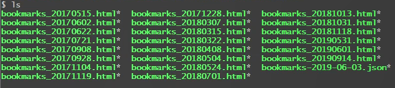
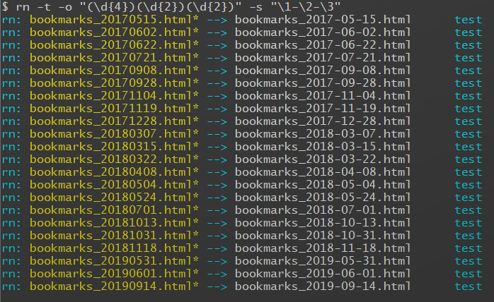
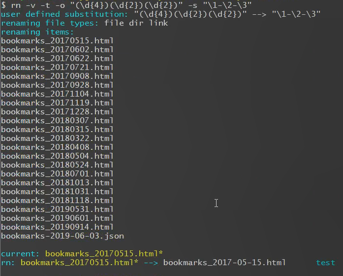
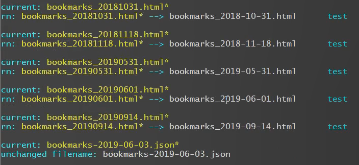
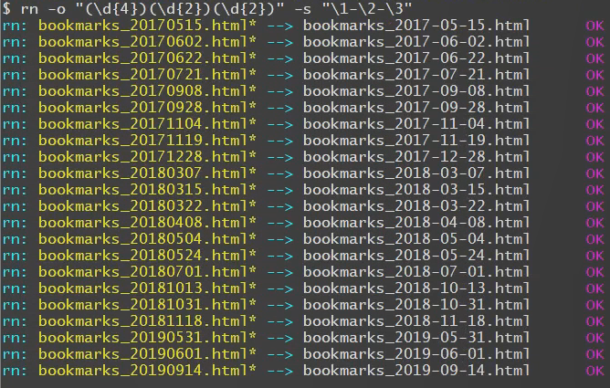
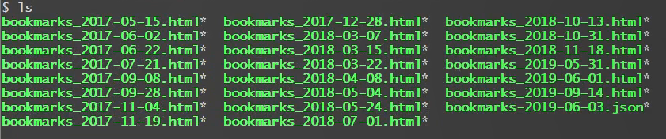
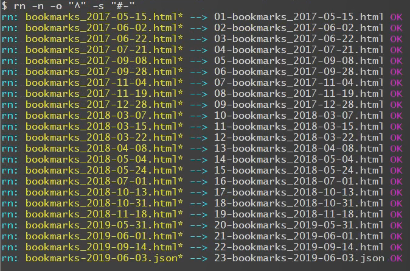

# Rename files with regex.

---------------
***Contents:***

> *[1. Introduction](#1)*   
> *[2. Examples](#2)*   
> *[3. Install](#3)*  
> *[4. Change Log](#4)*  
> *[5. License](#5)*   
> *[6. TODO](#6)*   
> *[7. Author](#7)*

---------------
<h2 id="1">1.Introduction</h2>

Use extented regular expression to rename files. If the "*origin*" and "*substitute*" are not given, you can still change the letter case and/or add serial number at the beginning of the filename.

    Usage:
        rn [options] [-o origin -s substitute] [files]

    Options:
        -o | --origin ptn   the original name pattern (support regex)
        -s | --substi ptn   the substitutional name pattern (support regex)
        -p | --space        filename contains space
        -f | --force        force mode, overwrite existing target
        -t | --test         test mode, show the results without real action 
        -r | --run          run mode, execute the renaming process
        -q | --quiet        quiet mode, show least information
        -v | --verbose      verbose mode, show most information
        -l | --lower        to lower case, use -f if the name is case insensitive
        -u | --upper        to upper case, use -f if the name is case insensitive
        -n | --number=[ch]  "ch" will be replaced by a serial number in substitute,
                            the default "ch" is "#"
             --nbegin #     beginning number when -n is used, defaulted as 1
             --nstep #      step number when -n is used, defaulted as 1 
             --nwidth #     least width of the serial number when -n is used,
                            defaulted as 2 (eg: 1 will be 01)
        -A | --all          all types of file will be renamed
        -F | --file         regular file will be renamed
        -D | --dir          directory will be renamed
        -B | --block        block device file will be renamed
        -C | --char         character device file will be renamed
        -S | --socket       socket file will be renamed
        -P | --pipe         pipe file will be renamed
        -L | --link         symbolic link file will be renamed
             --help         show this help information
             --version      show version information
             --regex        show quick reference of regex
             --example      show examples
             --return-code  show return codes

The "*origin*" and "*substitute*" should be given at the same time for command "**sed**" to do the substitution. If both were omitted, option --lower and --upper can be used to transform letter case of the "*files*", and option --number (together with number settings --nbegin, --nstep, and --nwidth) can be used to add serial number to the front of the "*files*".

If the "*files*" is omitted, the results of command "**ls**" is used. If there are spaces in filenames, use option --space, and each filename should occupy one line for the space " " cannot be used as Internal Field Separator (IFS) anymore. If the "*files*" has parent path (contains "/"s), only the filename part would be renamed, and the filename part could be file, dir, and so on.

Test mode is a good way to examine the renaming effect. The alias (**alias rn="rn -t"**) is strongly suggested to avoid mistakes since there is no roll-back option yet. Once it might work right, option --run could be added to start the operation.

Quiet mode will print no information except for the error messages. Verbose mode will print as much information as possible, which can be used to check the inner status. If there is no --quiet or --verbose option, the normal mode only print necessary information.

Some options might conflict, like --test & --run, --quiet & --verbose, --lower & --upper, only the last one takes effect. For example, "**rn -u -l**" means "**to lower case**"

The file type options (-FDBCSPL) are used to filter unexpected files. It can also be finished in argument "*files*" before passing in. If no file type option is given, the default types (file, dir, and link) are used.

-----------
<h2 id="2">2.Examples</h2>

#### Example 1: Add "-" between "*year*" "*month*" and "*day*" in filenames

- Files at the beginning 

- Rename **TEST MODE**

- Rename **VERBOSE TEST MODE**

......

- Rename **RUN MODE**

- Files after renaming

#### Example 2: Add serial number

--------------
<h2 id="3">3.Install</h2>

    git clone https://github.com/miboyu/rn
    (or git clone https://gitee.com/miboyu/rn)
    cd rn
    make install

--------------
<h2 id="4">4.Change Log</h2>

    1.0.3 (2019/09/19)
        Make the prompted command name dynamic.
        Add "makefile" to install the command.

    1.0.2 (2019/09/14)
        Change to extended regex "sed -E ...".
        Support more escape characters \d \D etc.
        Add option --regex to show quick reference of regex.

    1.0.1 (2019/09/13)
        Fix some bugs.
        Add more verbose information.

    1.0.0 (2019/09/12)
        Initial version.

--------------
<h2 id="5">5.License</h2>

This bash script is under license of GPLv3.

---------------
<h2 id="6">6.TODO</h2>
- Write renaming log, and add option --roll-back to roll back from the log.  
- Add more examples.

--------------
<h3 id="7">Author: Boyu Mi (miboyu@yeah.net)</h3>

Thanks for using the script. If you feel good about it, a recommemdation to your friends will be appreciated. Any bugs or suggestions, please contact the author (_miboyu@yeah.net_). Your feedback will help improving the script ^o^

--------------